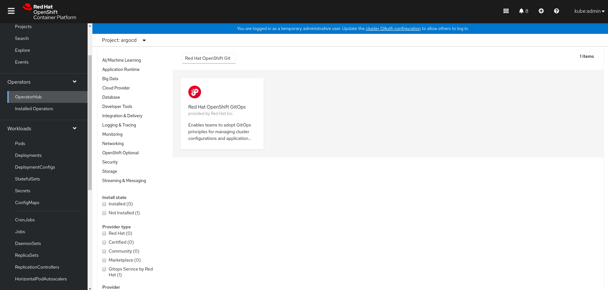

# OpenShift GitOps Operator

Red Hat OpenShift GitOps is a declarative continuous delivery platform based on [Argo CD](https://argoproj.github.io/argo-cd/). It enables teams to adopt GitOps principles for managing cluster configurations and automating secure and repeatable application delivery across hybrid multi-cluster OpenShift environments. Following GitOps and infrastructure as code principles, you can store the configuration of clusters and applications in Git repositories and use Git workflows to roll them out to the target clusters.

OpenShift GitOps Operator manages installation and configuration of components required to adopt GitOps principles on OpenShift. On installation, the operator will deploy and manage the following components

### Components

* [Argo CD](https://github.com/argoproj/argo-cd) for managing GitOps based deployments.
* [GitOps Application Manager](https://github.com/redhat-developer/kam) CLI to bootstrap a GitOps repository.
* [GitOps Service](https://github.com/redhat-developer/gitops-backend) which powers OpenShift GitOps UI.
* [OpenShift Pipelines Operator](https://github.com/openshift/tektoncd-pipeline-operator) for managing Tekton tasks and pipelines.

# Quick Start

## Install the operator from OperatorHub

Go to OperatorHub on OpenShift Webconsole and look for the "OpenShift GitOps" operator



Follow [OperatorHub](docs/operatorhub.md) deployment guide for detailed instructions.

## Making the operator available on the in-cluster OperatorHub

1. Add the following resource to your cluster

```
apiVersion: operators.coreos.com/v1alpha1
kind: CatalogSource
metadata:
  name: gitops-service-source
  namespace: openshift-marketplace
spec:
  displayName: 'Gitops Service by Red Hat'
  image: 'quay.io/redhat-developer/gitops-backend-operator-index:v0.0.1'
  publisher: 'Red Hat Developer'
  sourceType: grpc
```

2. Go the OperatorHub on OpenShift Webconsole and look for the "Gitops Service" operator.


3. Install the operator using the defaults in the wizard, and wait for it to show up in the list of "Installed Operators". I it doesn't go check on it's status in the "Installed Operators" in the `openshift-operators` namespace.


4. To validate if the installation was successful, look for the route named `cluster` in the `openshift-gitops` namespace. Note, the namespace doesn't have to exist in advance, the operator creates it for you.

That's it, your API `route` should be created for you. You don't need to expliclty create any operand/CR.

## Contribute

1. Clone the repository.
2. Login to your OpenShift cluster on your command-line.
3. `OPERATOR_NAME=gitops-operator operator-sdk run local --watch-namespace=""`

**Note:** Please check that you're using [operator-sdk]( https://github.com/operator-framework/operator-sdk/releases/tag/v0.17.2) version 0.17 or earlier. Since the community-operators do not support `v1` version of `CustomResourceDefinition`, the operator is using `v1beta1` version of `CustomResourceDefinition`.

## Tests

```
operator-sdk test local ./test/e2e --operator-namespace gitops-test --up-local
```

## Re-build and Deploy

This operator currently deploys the following payload.

```
quay.io/redhat-developer/gitops-backend:v0.0.1
```

If that's all what you are changing, the following steps are not needed in development
mode. You could update your image "payload" and re-install the operator.

* Build the operator image.

```
docker build -t quay.io/redhat-developer/gitops-backend-operator:v0.0.1
docker push quay.io/redhat-developer/gitops-backend-operator:v0.0.1
```


2. Build the Bundle image ( operator + OLM manifests )

```
operator-sdk bundle create quay.io/redhat-developer/gitops-backend-operator-bundle:v0.0.1
docker push quay.io/redhat-developer/gitops-backend-operator-bundle:v0.0.1
```

3. Build the Index image

```
opm index add --bundles quay.io/redhat-developer/gitops-backend-operator-bundle:v0.0.1  --tag quay.io/redhat-developer/gitops-backend-operator-index:v0.0.1 --build-tool=docker
docker push quay.io/redhat-developer/gitops-backend-operator-index:v0.0.1
```

The Index image powers the listing of the Operator on OperatorHub.
